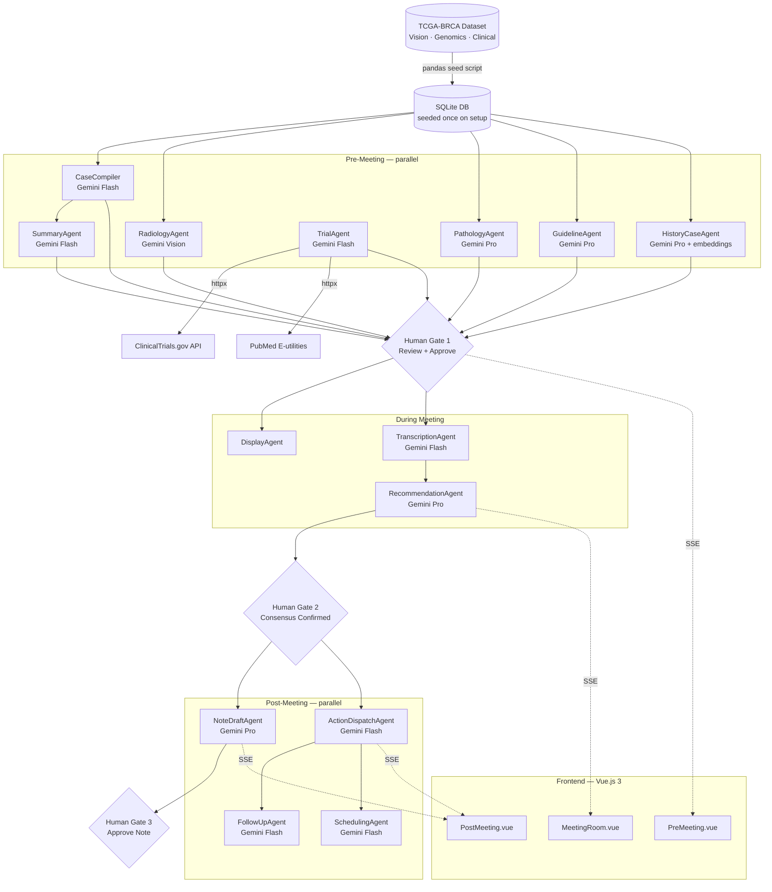

# ARCHITECTURE.md — OncoBoard.ai

## 1. Overview

OncoBoard.ai is a 13-agent AI system built on Google Gemini that automates the preparation, facilitation, and follow-up of breast cancer multidisciplinary tumor board meetings. It ingests three data modalities from the TCGA-BRCA dataset — H&E histopathology slide images, genomic expression profiles, and structured clinical records — and orchestrates specialized agents across three phases: pre-meeting (7 agents running in parallel to compile, analyze, and surface case intelligence), during-meeting (3 agents handling real-time display, transcription, and recommendation capture), and post-meeting (4 agents drafting notes, dispatching actions, and tracking follow-up). Clinicians retain all decision authority through three explicit human gates that are hard stops in the pipeline. The system talks to a FastAPI/SQLite backend, the Google GenAI SDK (Gemini Pro, Flash, and Vision), the ClinicalTrials.gov REST API, and NCBI PubMed E-utilities.

---

## 2. System Diagram

---

## 3. Components

### Data Layer (`src/data/`)
The dataset (Kaggle: `breast-cancer-vision-and-genomic-fusion-ml-ready`) is seeded into SQLite once at setup via a pandas script. Vision data ships pre-tiled as JPEG patches organized per patient and MRI series (`<patient>/<patient>_mri_processed/<series>/img_NNNN.jpg`); we ingest only the file paths into `case_files`, never the image bytes. Genomic copy-number data (~59,000 genes per patient from `CNV_RAW.csv`) is stored as a single JSON blob per case in `case_genomics.copy_numbers_json` — agents look up specific genes via `repository.get_gene_copy_numbers()`. Molecular subtype (Luminal A/B, HER2-enriched, Triple Negative) is derived deterministically at seed time from ER/PR/HER2 IHC status, since the dataset does not ship a pre-classified subtype column. Clinical TCGA fields are mapped to the tumor board case schema; the full raw rows are also preserved as `source_treatment_json` / `source_demographic_json` so agents can reach rare TCGA fields without us pre-modeling every column. Agents always query the DB — never the raw CSV — keeping agent code free of data wrangling logic.

### Pre-Meeting Agent Pipeline (`src/agents/`)
Seven agents run in parallel once a case is loaded. `CaseCompiler` pulls all linked records for a case and flags any missing fields. `RadiologyAgent` feeds image tiles to Gemini Vision and returns findings in BI-RADS language. `PathologyAgent` reads genomic copy-number data and biopsy fields and outputs a CAP synoptic-format report that references the seed-time molecular subtype already on the case and adds interpretive context (driver gene amplifications/deletions, prognostic markers). `GuidelineAgent` maps the patient's stage and receptor status to the current NCCN/ESMO protocol and returns the matched recommendation with evidence level. `TrialAgent` calls ClinicalTrials.gov for recruiting trials and PubMed for supporting literature, matching on ER/PR/HER2, stage, and age. `HistoryCaseAgent` runs semantic vector search over the DB to surface the top three analogous past cases with their outcomes. `SummaryAgent` waits for `CaseCompiler` then synthesizes all inputs into a one-page structured clinical narrative.

### During-Meeting Agent Pipeline
`DisplayAgent` is a thin formatting layer that serves the pre-meeting outputs to the board UI in a structured layout — no LLM call. `TranscriptionAgent` processes the live audio stream via Gemini Flash and returns a speaker-tagged transcript. `RecommendationAgent` reads the transcript stream with Gemini Pro and identifies decision moments, capturing the emerging consensus in a structured format before Human Gate 2.

### Post-Meeting Agent Pipeline
`NoteDraftAgent` takes the transcript and confirmed recommendation and produces a structured tumor board note ready for EHR entry. `ActionDispatchAgent` parses the decisions for discrete action items, assigns owners, sets due dates, and writes them to the DB. `FollowUpAgent` tracks completion status of open actions and surfaces overdue items. `SchedulingAgent` reads pending lab results and open items to flag which cases need re-presentation at the next board.

### API Layer (`src/api/`)
FastAPI handles all routes. Agent runs are triggered via POST and their outputs are streamed back to the frontend using Server-Sent Events (SSE) via `StreamingResponse`. Human gate confirmations arrive as PATCH requests that unlock the next pipeline phase. All writes go through the DB models layer — no route handler touches SQLite directly.

### DB Layer (`src/db/`)
SQLite with a strict models layer. Core tables: `cases`, `case_files`, `agent_outputs` (one row per agent per run, stores typed JSON), `sessions`, `transcripts`, `recommendations`, `actions`. No raw SQL outside `src/db/`. This constraint keeps agent code readable and makes the data layer independently testable.

### Frontend (`frontend/`)
Three views map directly to the three pipeline phases: `PreMeeting.vue` renders the agent status grid and streams outputs as they arrive, `MeetingRoom.vue` shows the live transcript and DisplayAgent output, `PostMeeting.vue` handles the note draft and action item tracking. Pinia stores hold session state. Agent status chips follow the four states from `Branding.md`: Idle, Running, Done, Error. The design system (Google Material, tokens in `assets/tokens.css`) is fully defined in `Branding.md`.

---

## 4. Key Decisions

### SSE over WebSocket for agent output streaming
Agent outputs are strictly server-to-client — each agent produces one structured result that streams progressively to the UI. WebSockets would add bidirectional complexity with no benefit since agents do not need to receive messages from the frontend mid-run. SSE integrates cleanly with FastAPI's `StreamingResponse`, requires no additional client library, and is natively supported by all modern browsers.

### SQLite over PostgreSQL
The dataset is a fixed, seeded corpus of approximately 1,000 TCGA-BRCA cases. There is no concurrent write contention — agents read from the DB and writes happen only via the models layer at defined checkpoints. SQLite's file-based nature makes the project fully self-contained and trivially deployable for demo and evaluation without a separate database server. The switch to PostgreSQL is a one-line connection string change if the project scales.

### Hardcoded orchestration over LLM-as-router
The pre-meeting agent sequence is deterministic: `SummaryAgent` always waits for `CaseCompiler`, and post-meeting agents never run before Human Gate 2. Using an LLM to route between agents would introduce non-determinism into a clinical workflow where predictability is a patient safety requirement. An LLM router is appropriate for open-ended conversational agents. Here, the flow is known, bounded, and must be auditable — so orchestration is code, not a model call.

### Tiered model selection: Pro vs Flash per agent
Not every agent needs the same reasoning depth. `RadiologyAgent` and `PathologyAgent` perform complex multimodal interpretation and specialist language generation — these use Gemini Pro. `CaseCompiler`, `TrialAgent`, `ActionDispatchAgent`, and `FollowUpAgent` perform structured extraction and lookup tasks where speed matters more than depth — these use Gemini Flash. This tiered approach reduces latency on the critical pre-meeting parallel run and lowers API cost without sacrificing quality where clinical accuracy is highest-stakes.

### Structured typed dicts over free-text agent outputs
All agents return typed Python dicts, not natural language strings. Free-text outputs would require downstream parsing, introduce failure modes at agent handoff points, and make the frontend rendering logic fragile. Structured outputs let the DB store agent results in queryable form, let downstream agents consume them as clean inputs, and let the frontend render deterministically without parsing heuristics.

### Semantic vector search over SQL for HistoryCaseAgent
SQL similarity queries on genomic profiles would require exact-match or range queries that miss semantically similar cases — two patients with different raw expression values but the same effective molecular subtype and treatment response would not be retrieved. Gemini text-embedding-004 on the combined genomic and clinical profile vector finds cases that are meaningfully similar, not just numerically close. The tradeoff is a one-time embedding computation cost at seed time, which is acceptable for a fixed dataset.

### Dataset seeded into DB over live CSV reads
Agents query SQLite, never pandas DataFrames directly. This keeps agent files free of data wrangling imports, makes the slow preprocessing step (tile extraction, normalization, embedding) run once rather than on every agent invocation, and means the data is joinable and queryable in ways a CSV is not.

---

## 5. Limitations and Out of Scope

**No real EHR integration.** Data comes from the TCGA-BRCA research dataset, not from a live Epic or Cerner instance. The tumor board note produced by `NoteDraftAgent` requires manual copy-paste into a real EHR in this version.

**No DICOM or PACS integration.** The system uses preprocessed image tiles from the dataset, not DICOM files pulled from a hospital PACS workstation. Real deployment would require a DICOM pipeline and secure PACS connectivity.

**TranscriptionAgent is a stub in the MVP.** Live audio transcription requires a HIPAA-compliant audio pipeline and speaker diarization infrastructure. In the current build, the transcription flow is simulated with pre-loaded transcript fixtures for demo purposes.

**No HIPAA compliance infrastructure.** OncoBoard.ai is a research prototype. It has no encryption at rest, no access controls, no audit logging, and no BAA with any cloud provider. It is not suitable for real patient data.

**Single-institution research data.** TCGA-BRCA is a curated research corpus. It may not represent the full distribution of breast cancer presentations seen in a clinical setting, particularly for underrepresented populations.

**No authentication or role-based access control.** Any user can access any case in the current build. Production would require role separation between coordinators, specialists, and administrators.

**Genomics data is research-grade.** Mutation calls in the dataset may differ from clinical-grade testing outputs (Foundation Medicine FoundationOne CDx, Tempus xT). `PathologyAgent` outputs should be treated as reference information, not clinical reporting.

**HistoryCaseAgent prior cases are from the same dataset.** In a real deployment, the analogous cases would come from the institution's own historical tumor board decisions, providing locally-validated precedent. The current implementation uses TCGA cases as a proxy.
